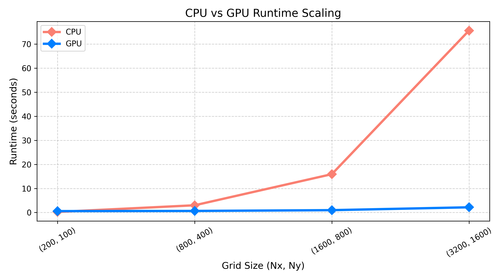

# assignment-7
module load nvhpc

module load cuda

module load craype-accel-nvidia80

nvc++ -mp=gpu -gpu=cc80 -Ofast laplace2d.cpp -o laplace -Minfo=accel,mp

srun -p gpu --gres=gpu:1 --ntasks=1 --time=00:05:00 --mem=40G ./laplace

## "results analysis": 

Changed code from serial → parallel (OpenMP CPU)

Added #pragma omp parallel for to main loops

Used collapse(2) to parallelize nested loops

Added reduction for kinetic energy calculation

Identified loops with no data dependency

Separated update and copy steps (Jacobi-mode)

Switched from CPU to GPU offloading (OpenMP target)

Replaced CPU pragmas with target teams distribute parallel for

Added collapse(2) for GPU to increase parallelism

Used #pragma omp declare target for helper functions (pressure, fluxX, fluxY)

Added target data map(...) to move arrays to GPU memory

Fixed bug by moving boundary conditions to GPU (avoid host-device mismatch)

Added runtime measurement using chrono

## Runtime Comparison

| Grid Size (Nx, Ny) | CPU Time (s) | GPU Time (s) |
|--------------------|-------------|-------------|
| (200, 100)         | 0.230212    | 0.574674    |
| (800, 400)         | 3.00168     | 0.647328    |
| (1600, 800)        | 15.9352     | 0.973897    |
| (3200, 1600)       | 75.6512     | 2.16255     |

The code was optimized by parallelizing loops and offloading computation to the GPU, significantly reducing runtime especially for larger grid sizes.

* CPU gets very slow with size increase

* GPU stays almost constant for small-medium sizes

*At largest size → GPU is ~35× faster

